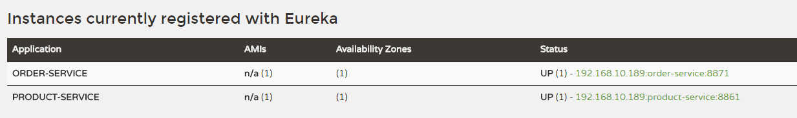

### 1.前言
在实际的开发中，往往要涉及到多个服务的调用，比如下单减库存，这里就涉及到订单模块调用商品模块。
而spring cloud 有两种服务调用的方式，一种是ribbon+restTemplate，另一种是feign。
这篇文章准备讲述spring cloud fegin,使用spring cloud fegin完成更为优雅的http的调用方式，以及在服务之间的调用与远程调用的注意上，还有一些使用的问题。

### 2.准备工作

采用feign来进行服务之间的调用，一般都是需要一个注册中心，这回就采用eureka作为注册中心，以供于两个服务进行服务注册和服务发现，创建三个spring-boot工程模块（创建模块的过程省略，如不知请百度），总体服务列表如下：

* registry: 服务注册中心，用于服务注册和服务发现。

* order-service: 订单服务，服务消费者。

* product-service: 商品服务，服务提供者

老套路，创建模块三部曲：
1. POM文件引入依赖项；
2. 修改配置文件；
3. Java文件加注解。

> 注意：本示例的spring-cloud版本为Camden.SR5

```
<dependencyManagement>
    <dependencies>
        <dependency>
            <groupId>org.springframework.cloud</groupId>
            <artifactId>spring-cloud-dependencies</artifactId>
            <version>Camden.SR5</version>
            <type>pom</type>
            <scope>import</scope>
        </dependency>
    </dependencies>
</dependencyManagement>

```


### 3.创建registry模块
1. POM文件中引入registry的依赖

```
<dependency>
    <groupId>org.springframework.cloud</groupId>
    <artifactId>spring-cloud-starter-eureka-server</artifactId>
</dependency>
```
2. 配置application.yml文件

```
spring:
  application:
    name: registry

server:
  port: 8761

eureka:
  instance:
    hostname: localhost
  client:
    registerWithEureka: false
    fetchRegistry: false
    serviceUrl:
      defaultZone: http://${eureka.instance.hostname}:${server.port}/eureka/
```
通过eureka.client.registerWithEureka：false和fetchRegistry：false来表明自己是一个eureka server.

3. 文件RegistryApplication中加入注解

```
@SpringBootApplication
@EnableEurekaServer
public class RegistryApplication {
    public static void main(String[] args) {
        SpringApplication.run(RegistryApplication.class, args);
    }
}

```

### 4. 创建product-service模块
1. POM文件中引入product-service的相关依赖

```
<dependencies>
    <dependency>
        <groupId>org.springframework.cloud</groupId>
        <artifactId>spring-cloud-starter-eureka</artifactId>
    </dependency>
    <dependency>
        <groupId>org.springframework.boot</groupId>
        <artifactId>spring-boot-starter-web</artifactId>
    </dependency>
    <dependency>
        <groupId>org.springframework.boot</groupId>
        <artifactId>spring-boot-starter-test</artifactId>
        <scope>test</scope>
    </dependency>
</dependencies>
```
2. 配置application.yml文件

```
spring:
  application:
    name: product-service

server:
  port: 8861

eureka:
  client:
    serviceUrl:
      defaultZone: http://localhost:8761/eureka/
  instance:
    prefer-ip-address: true
```
prefer-ip-address表明添加注册中心中的ip代替主机名

3. 新建ProductServerApplication.java文件，在ProductServerApplication中加入注解

```
@SpringBootApplication
@EnableDiscoveryClient
public class ProductServerApplication {
    public static void main(String[] args) {
        SpringApplication.run(ProductServerApplication.class, args);
    }
}

```
4. 新建controller包，在此包下新建ProductController.java文件，商品服务提供相关的Api,访问地址：/product/get?name=jiangrj，代码如下：

```
@RestController
@RequestMapping("/product")
public class ProductController {
    @RequestMapping("/get")
    public String get(@RequestParam String name) {
        return "hello "+name+"，this is product info ";
    }
}

```

### 4. 创建order-service模块
1. POM文件中引入order-service的相关依赖

```
<dependencies>
    <dependency>
        <groupId>org.springframework.cloud</groupId>
        <artifactId>spring-cloud-starter-eureka</artifactId>
    </dependency>
    <!-- 引入Feign-->
    <dependency>
        <groupId>org.springframework.cloud</groupId>
        <artifactId>spring-cloud-starter-feign</artifactId>
    </dependency>
    <dependency>
        <groupId>org.springframework.boot</groupId>
        <artifactId>spring-boot-starter-web</artifactId>
    </dependency>

    <dependency>
        <groupId>org.springframework.boot</groupId>
        <artifactId>spring-boot-starter-test</artifactId>
        <scope>test</scope>
    </dependency>
</dependencies>
```
2. 配置application.yml文件

```
spring:
  application:
    name: order-service

server:
  port: 8871

eureka:
  client:
    serviceUrl:
      defaultZone: http://localhost:8761/eureka/
  instance:
    prefer-ip-address: true
```

3. 新建OrderServerApplication.java文件，在OrderServerApplication中加入注解

```
@SpringBootApplication
@EnableDiscoveryClient
@EnableFeignClients //开启Feign
public class OrderServerApplication {
    public static void main(String[] args) {
        SpringApplication.run(OrderServerApplication.class, args);
    }
}
```


4. 新建client包，新建ProductClient.java文件，商品服务调用客户端，代码如下：

```
@FeignClient(name= "product-service") //配置文件中注册到注册中心的名字
public interface ProductClient {
    @RequestMapping(value = "/product/get") //方法和ProductController一致
    String get(@RequestParam(value = "name") String name);
}
```
5. 新建controller包，新建OrderController.java文件，订单服务提供相关的Api，通过ProductClient来调用商品服务，访问地址：/order/create/jiangrj，代码如下：

```
@RestController
@RequestMapping("/order")
public class OrderController {
    @Autowired
    ProductClient productClient;
    
    @RequestMapping("/create/{name}")
    public String create(@PathVariable("name") String name) {
        System.out.println("create order!");
        //调用商品服务
        return productClient.get(name);
    }
}
```

### 5. 测试
依次启动Registry，product-service，order-service三个服务，在浏览器中输入http://localhost:8761,观察服务状况，如下图:


两个服务都正常启动，
现在直接在浏览器中输入http://localhost:8861/product/get?name=jiangrj，调用product-service提供的Restful接口,浏览器显示:

`hello jiangrj，this is product info`

接着在浏览器中输入http://localhost:8871/order/create/jiangrj,调用order-service服务，从而调用商品服务

> 浏览器显示：hello jiangrj，this is product info

> 控制台打印：create order!

### 6.总结
在这个简单的应用中，order-service通过feign调用product-service的服务，整个应用编写的还是比较简单，而且feign还有许多其他有意思的特性。
像参数属性，处理不同的参数；设置断路器，如果服务调用失败的话，可以调用本地写的failback方法，返回一些默认信息或者抛错之类。
还有feign在使用过程中有许多坑。这些将在后续的文章中一一道来。

